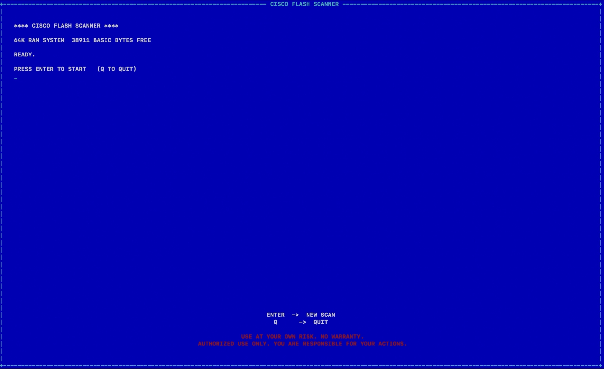
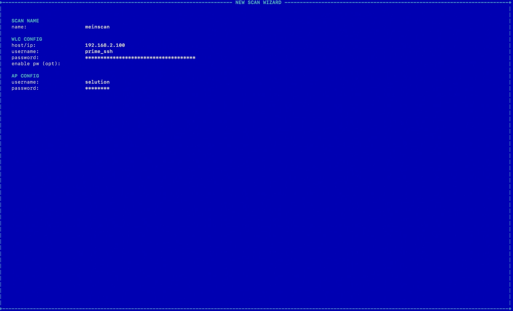
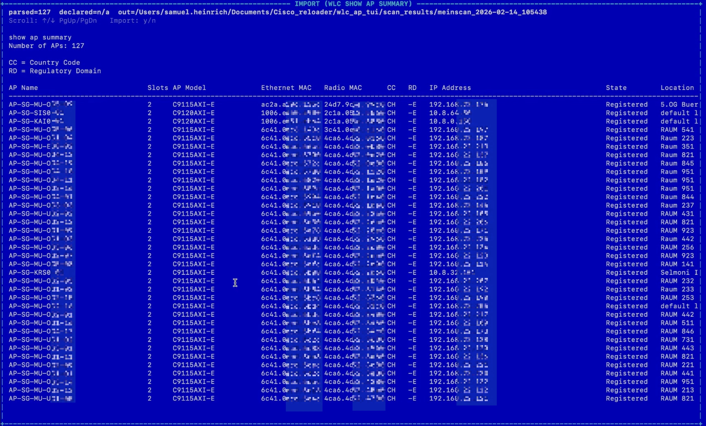
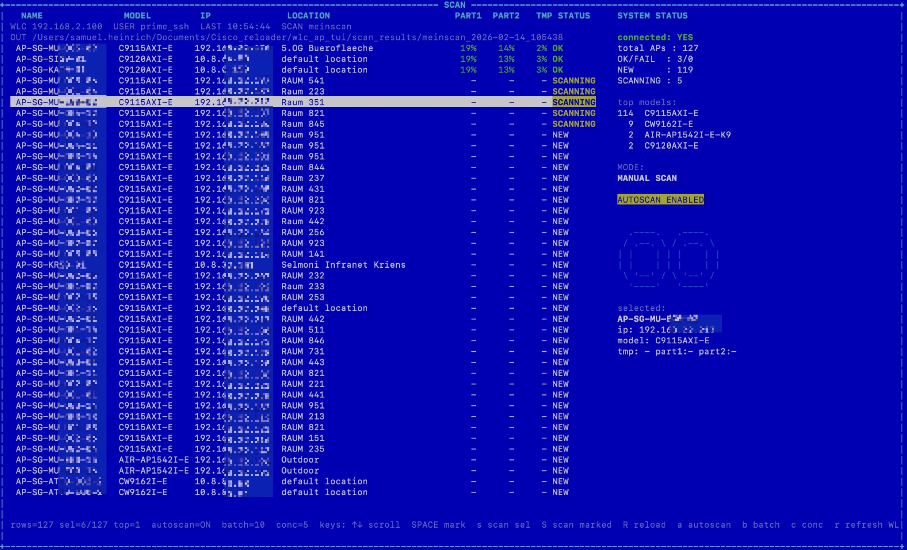
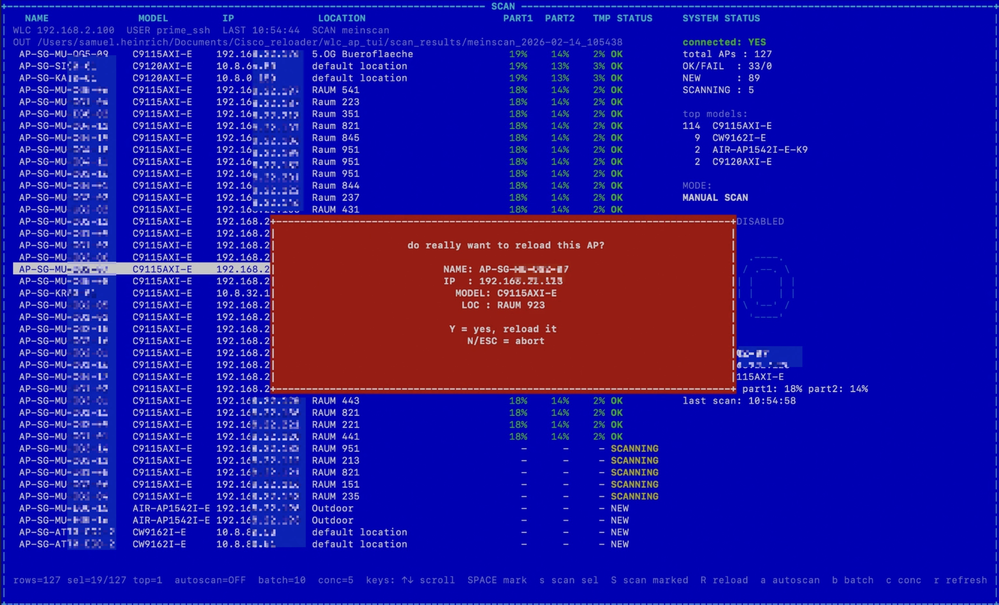

# CISCO FLASH SCANNER

C64-ish terminal UI to fetch AP inventory from a Cisco WLC and scan AP filesystems via SSH.

## Why This Exists

Cisco Catalyst APs can get into broken states where flash/tmp fills up and they stop behaving properly (stuck downloads, join issues, not joining the WLC, etc.).
When you have dozens or hundreds of APs, you need a fast way to:

- pull a complete AP inventory from the WLC
- check filesystem utilization (`/part1`, `/part2`, `/tmp`) across many APs
- trigger a reload quickly (with a safety confirmation)

Related Cisco guidance (background / recovery workflow):
https://www.cisco.com/c/en/us/support/docs/wireless/wireless-lan-controller-software/225443-validate-and-recover-catalyst-aps-on.html

## Requirements

- `python3`
- `ssh`
- `expect`
  - macOS: `brew install expect`

## Run

```bash
cd wlc_ap_tui
./wlc_ap_tui.py
```

## Screenshots

Home / boot:



Scan wizard:



Import WLC `show ap summary`:



Scan view (inventory + filesystem utilization):



Reload confirmation modal:



## Keys (Scan Screen)

- `↑/↓` scroll
- `SPACE` mark/unmark
- `s` scan selected
- `S` scan marked
- `a` autoscan toggle
- `b` set batch size
- `c` set concurrency
- `r` refresh WLC list
- `e` show last error of selected AP (footer)
- `R` reload selected AP (2-step confirm, red modal)
- `q` back to home

## Output

Each scan creates a folder under `wlc_ap_tui/scan_results/<scanname>_<timestamp>/`:

- `aps.json`
- `aps.csv`
- `wlc_show_ap_summary.txt`
- `events.log`

## Demo Data

This repo may include anonymized demo scans under `wlc_ap_tui/demo_data/`.

## Disclaimer

Use at your own risk. No warranty. Authorized use only.
